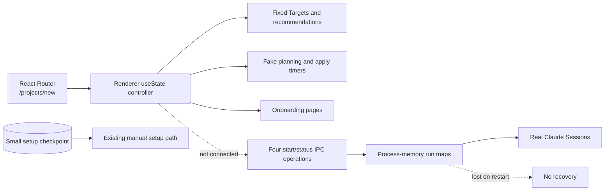
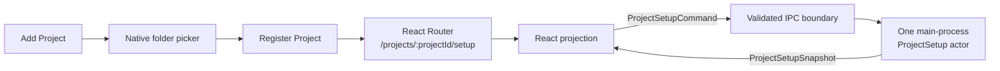
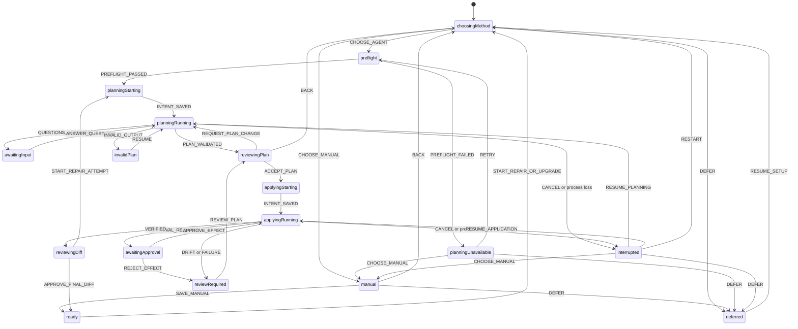
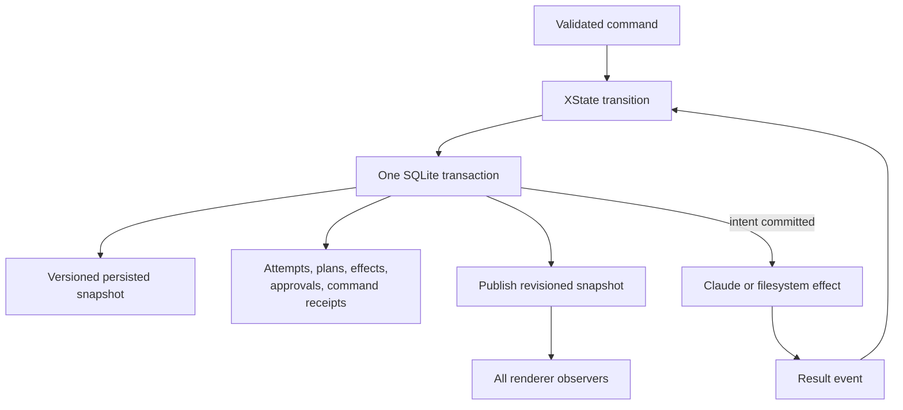

# Project setup is one durable XState actor

Status: accepted (#2381, #2393) · 2026-09-21

Project setup uses one XState v5 actor for each registered Project. The actor runs in the Electron
main process, selects every onboarding page, owns every durable transition, and survives renderer
reloads and application restarts. React renders validated snapshots and sends validated commands.

This decision uses PR #2515 as its starting point. That PR proves the Claude planning and applying
contracts, but it does not yet connect them to the production flow.

## Current flow in PR #2515

The `/projects/new` route renders a local React controller. The controller stores the complete flow
in `useState`, fills it with fixed sample data, and advances planning and application with timers.
Closing the renderer loses the flow.

The main process separately exposes four operations: start planning, read planning status, start
application, and read application status. Each start operation creates a `runId`. Process-memory
maps store progress and results, so an application restart loses them. The renderer flow does not
call these operations.

The existing SQLite checkpoint stores only the manual setup phase, worktree path, configuration
source, and Setup document revision. It cannot restore an agent Session, a reviewed plan, an
accepted revision, application progress, or final approval.

## Registration boundary

Folder selection is Project registration, not ProjectSetup. Add Project opens the native folder
picker and registers the Project first. An unconfigured Project then opens
`/projects/:projectId/setup`.

This boundary lets the main process create or restore one actor with a stable Project ID. It also
prevents a temporary actor from competing with an existing actor when the user selects a Project
that Argo already knows.

React Router owns application-level routes only. It does not own onboarding phases. Back buttons
inside onboarding send events to the actor, and the actor snapshot selects the next page.

## Machine boundary

One main-process registry returns one logical ProjectSetup actor for each Project. The registry
loads the durable checkpoint on first access. Several windows can observe one actor, but only the
actor can change its state.

Commands contain a unique command ID and the expected ProjectSetup revision. The actor rejects a
stale command and returns the current snapshot. Repeating a processed command returns its existing
result and does not repeat its effect.

The renderer has no second workflow machine. It can keep incidental view state, such as the
selected diff file, an expanded row, scroll position, or an open popover. That state does not cross
IPC and does not select an onboarding page.

The planning result contains either focused questions or a valid plan. The agent cannot return
`cannot-plan`. Argo handles an unreadable Project, an unavailable Harness, or an invalid Setup
document before starting the Session. A lost Session becomes `interrupted`, and invalid agent
output becomes `invalidPlan`.

Argo validates the plan's source fingerprints before acceptance and again before application. A
relevant Project change requires a new plan revision. The actor never applies a stale plan.

## Statechart

`ready` and `deferred` are durable resting states. They are not XState final states because repair,
upgrade, or deferred setup can reactivate the same ProjectSetup.

The diagram omits guarded details. Resume returns only to the interrupted phase. Restart and final
diff rejection create a new numbered Attempt. Back is unavailable while an external effect runs;
the user must cancel first.

## Attempts and Sessions

A ProjectSetup has numbered Attempts. Attempt numbers increase and are never reused. Planner
questions and requested plan changes remain in the same Attempt and resume the same planning
Session. Each accepted revision is immutable.

Resume continues the current Attempt and Session. Restart abandons the current Attempt and creates
the next Attempt. Rejecting the final diff also creates the next Attempt, with the previous plan,
result, and feedback as evidence.

Application always uses a fresh Session. The user can choose a different eligible Harness before
application, so an Attempt records its planning Harness and applying Harness separately.

## Persistence

SQLite stores a versioned XState persisted snapshot for exact restoration. The same transaction
stores the ProjectSetup revision and every domain record changed by the transition.

The persisted snapshot owns the operational position, machine context, state history, and current
page. Separate durable records own Attempts, immutable plan revisions, accepted plans, Session
IDs, setup-worktree fingerprints, effect intents, effect results, approvals, final diffs, and
processed command IDs. Machine context refers to those records by stable ID instead of copying
large artifacts or transcripts.

The stored envelope contains the checkpoint schema version, machine version, ProjectSetup
revision, persisted XState snapshot, and save time. Explicit migrations upgrade compatible
versions. A corrupt or newer unsupported checkpoint opens recovery and preserves the original
record.

The snapshot is not the only durable record. XState warns that machine changes can make stored
snapshots incompatible. XState also restarts invoked actors during restoration. Argo therefore
does not persist Claude or filesystem effects as restorable child actors.

If a checkpoint says that an effect was active, restoration maps it to `interrupted` before the
actor starts. Resume first reconciles the Session and setup worktree. It continues only when the
recorded baseline and fingerprints explain the current files.

## Effects and approvals

The machine stores an effect intent before it starts Claude or filesystem work. It stores the
observed result afterward. Connection and status reads can retry automatically, but planning,
application, and filesystem effects require a user command before a retry.

The machine stores only the latest progress state for each plan item. The Session transcript owns
the full conversation history. Closing or reloading a renderer does not stop an effect. Explicit
Cancel stops the Session and moves the Attempt to `interrupted` after the stop is observed.

Application pauses in `applying.awaitingApproval` for commands, destructive changes, collisions,
or uncertain merges. The snapshot contains the exact proposed effect. Approval resumes the same
apply Session. Rejection returns to review or creates a repair Attempt.

## Method and completion rules

Manual setup validates JSON shape and stores Project details as Argo-owned state in SQLite. It does
not inspect files, run commands, invoke an agent, install dependencies, change Project files, or
create a setup worktree.

Agent setup uses a dedicated setup worktree. Accepting a plan records the exact revision and starts
application. The apply Session receives only that accepted plan. It verifies every retained Target
and then presents the observed final diff.

Approving the final diff changes ProjectSetup to `ready`. Open Project then points the Project at
the approved setup worktree. Publication remains the later #2395 flow, and the original checkout
remains untouched.

Skip stores `deferred` and opens the Project. Setup remains available. Active, interrupted,
rejected, and abandoned setup worktrees remain recoverable until explicit discard. Publication
removes its worktree only after human merge and post-merge validation.

## Consequences

- PR #2515's `OnboardingRunStore`, `runId`, four polling operations, renderer controller, fake
  progress timers, and `cannot-plan` result are replaced rather than wrapped.
- `validateAcceptedSetupPlan` runs inside the authoritative command transition. It compares the
  complete immutable content, not only item IDs and fingerprints.
- The IPC operation table carries validated ProjectSetup commands and snapshots. The renderer
  cannot send raw XState events or receive raw persisted snapshots.
- Storybook supplies explicit snapshots to render every page. Machine transition tests prove the
  flow, and integration tests prove persistence, restart, idempotency, and effect ordering.
- This keeps ADR-0023's surviving rule that one owner holds authoritative state and the UI is a
  projection. It replaces that ADR's retired runtime context with the Electron replacement built
  under #1730.

## Rejected alternatives

A renderer-only machine cannot own durable effects after its window closes. Two machines, one in
each process, create synchronization and ownership failures. A React Router route for every phase
creates a second workflow state machine. Process-memory runs cannot recover after restart. A raw
XState snapshot alone cannot provide stable audit records or safe migrations.
