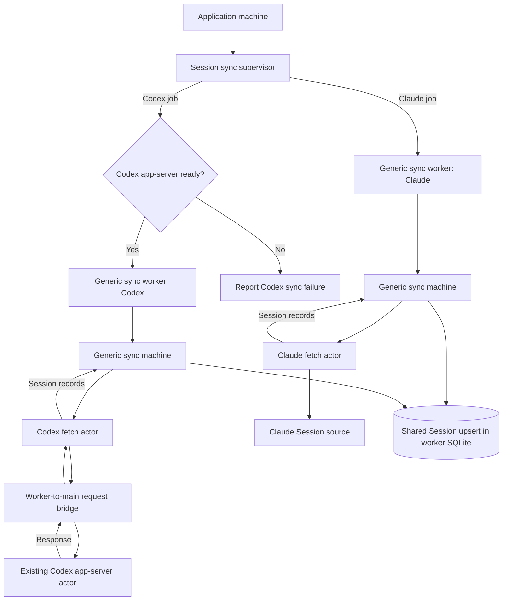

# SQLite read models for Sessions and Tickets

Status: accepted · 2026-09-24 · Session discovery amended 2026-09-27

## Amendment · watched Sessions and the pushed roster · 2026-09-28

Each Harness registration names where it writes Session history, how to read the lines it
appends, and which lines open or close a turn. When an open Feed's history file grows, Argo reads
only the new lines. It appends their events to the live journal, unless the Session has a live
channel. A rewritten, truncated or branched file still makes the Feed read the whole history.

The roster is one subscription. It sends the whole list first. After a sync commits, a live
status changes, a rename, or a write to any history file, it sends each changed row, or the whole
list again when the order or total changed. A history write sets the row's `activityAt` in SQLite.
It also records, in memory, whether the file's current turn is open or closed. The newest opened
turn is the current one. A close counts only when it names that turn or names no turn, so a late
close for an earlier Codex turn leaves the newer turn open. A Session with no live actor shows
running for an open turn and idle for a closed one. The roster's activity line for a Session
whose Feed is open is the activity that Feed's main reading published. An open turn
whose file stays quiet for five minutes shows unknown, because a killed terminal writes nothing
more.

## Amendment · Harness registrations for sync · 2026-09-28

The sync supervisor reads each Harness's `sessionDiscovery` from its registration and runs the
same sync machine for every Harness. Codex discovery uses the shared client the app machine owns;
no Codex app-server actor or readiness bridge remains. A Harness whose client cannot connect fails
its own job, and the other Harnesses still sync. One status subscription combines every Harness's
progress and forwards each commit; an active scan outranks a failure, and a failure outranks
ready, so one failed Harness reports its own failure text.

Live Feed replay is bounded. One memory journal keeps the newest 500 events and 2 MiB across all
Sessions, and each launch starts a new generation. A cursor older than the journal, or from an
earlier generation, reads vendor history and merges rows by stable item ID. A Session with no Argo
live channel is only as fresh as its Harness's history watcher, as the amendment on watched
Sessions above describes.

## Amendment · Codex live Session ownership · 2026-09-28

The Codex registration supplies the same async live channel interface as Claude. The generic
Argo live Session machine owns both lifecycles. The app machine still owns one shared
Codex app-server client for live Sessions, catalog, discovery, and history. A Codex Session
failure does not stop another Harness. The Feed reads one complete `thread/read` snapshot per
chain and merges live events into it.

## Amendment · Claude live Session ownership · 2026-09-28

The live Session supervisor keeps Claude commands in order and records each command ID before it
opens or sends through the Claude channel. A small SQLite table keeps the command outcome and its
Argo Session ID when that ID becomes available. This table does not store Feed content or vendor
history. The unique Harness and native Session ID pair still identifies one Session row.

The Claude registration supplies the async channel. The generic Argo live Session machine owns its
lifetime. The Claude Harness machine name in **Module ownership** is superseded. Codex keeps its
existing live machine until its channel migration.

## Amendment · command recovery · 2026-09-28

The `session_command` table also stores a draft revision identity, Harness and native Session
identities, and a vendor turn ID when known. It stores no prompt, live event payload, or vendor
history. The Session table still owns durable Session identity.

Argo records the command before vendor delivery. On restart, it marks unfinished outcomes
uncertain and reads vendor history for commands with a native Session ID. A matching vendor item
or turn can change an uncertain outcome to running. Argo never resends an uncertain command.
A command without a known native Session ID stays uncertain until vendor evidence arrives.

## Amendment · stateless Harness discovery · 2026-09-27

The worker topology in **Sync and reads**, its diagram, and the worker ownership in **Module
ownership** are superseded. Each Harness registration now exposes one stateless
`sessionDiscovery` function. The shared Session sync machine calls that function with the known
native Session IDs and receives generic Session records plus a malformed-record count. Harness
source selection, vendor schemas, and parsing stay under `src/harnesses/<harness>/`.

The supervisor selects `harnesses[harnessId].sessionDiscovery`, prevents concurrent syncs for the
same Harness, and runs the shared sync machine in the main process. That machine owns retries,
progress, Project matching, and batched writes through the application database connection. A
failed batch keeps earlier commits. No Session discovery worker, worker job schema, or
worker-to-main bridge remains.

Codex discovery closes over the existing app-server request function supplied when its Harness is
registered. It reads thread metadata through that shared client and starts no second Codex
process. Claude discovery reads the Agent SDK directly. Adding another Harness requires one
function with the same input and output shape and one registration entry; shared Session sync code
does not branch on the Harness or its source.

The Session list currently mixes vendor pages with SQLite metadata. The renderer must reconcile
source cursors and Argo-owned fields, so paging and search depend on adapter behavior. Ticket
queries have a similar split. Argo will give the renderer one validated IPC read surface backed by
SQLite for Sessions and Tickets. Live connections and mutations still go through their Harness
machines and vendor interfaces. Delivery facts, including pull requests and CI, need a separate design.

## Identity and ownership

One Session table holds the Argo UUID, unique `(Harness, native Session ID)` pair, and indexed
vendor metadata. Argo creates the row after a Session it starts receives a native ID. Later sync
finds the same UUID. The pair remains the vendor identity for history and resume. Forks are
separate Sessions. The Project link is nullable and clears when its Project is deleted. A new
working directory can move a Session to another Project. A missing directory preserves the known
Project. Argo owns pins, pinned order, and user-asserted Ticket links.

One custom title follows the vendor across Argo and other clients. An authoritative vendor read
can replace or clear it. Sparse metadata does not erase other known values. The display order is
custom title, linked Ticket title, vendor preview, then first prompt. Linking a Ticket does not
copy its title or rename the vendor Session. Claude supplies its custom title separately. Its
summary becomes a preview only when distinct. Codex supplies name and preview separately.
Argo does not read a transcript to manufacture a preview. A later slice adds vendor-backed rename.
The effective Ticket link follows ADR-0017: a positive branch-derived Delivery-to-Ticket link wins;
an asserted Delivery-to-Ticket link fills only an unlinked derivation; a branchless Session can
assert its own Ticket link. An asserted link survives provider disconnection and Ticket deletion.

Vendor Session metadata shares the Session table with Argo identity. Searchable history text and
Ticket content can use disposable SQLite query tables. Their providers remain authoritative. The
Ticket index covers the active backlog and
Tickets linked to Argo work. Search tells the reader when older Ticket history is not indexed. A
missing Ticket opened by direct reference can get a priority sync and a loading state until its
row is committed. The first Session list milestone has no priority open sync. A vendor-confirmed
permanently unrecoverable Session can be removed with its pin and user-asserted Ticket link. A
failed scan, omitted list item, or temporary resume refusal does not establish permanent loss.

Every Ticket also has an Argo UUID and a unique `(provider, provider scope, native Ticket ID)`
identity. Connections provide current access but do not define the Ticket: two Projects connected
to the same provider scope see one Ticket and keep its Argo UUID after reconnect. When a provider
confirms deletion, Argo keeps that UUID, the last known title, and user-asserted links. The UI
groups the Ticket with closed work and gives the reason `deleted`; this does not claim that the
provider reported a closed status. A lost Connection or failed read does not establish deletion.
Adapters distinguish verified permanent loss or deletion from authorization failure, inaccessible
scope, rate limiting, list omission, and transient failure. Only an authenticated native read with
sufficient provider evidence establishes permanent loss or deletion. If the provider cannot prove
which outcome occurred, Argo keeps the local identity and reports uncertainty.

## Sync and reads

The app XState machine invokes one long-running Session sync supervisor after database migration.
The supervisor receives Refresh, reads the list of Harnesses supported for Session sync, and
dispatches one generic sync worker for each Harness job. Each dispatched worker owns one thread.
The supervisor tracks the jobs, prevents duplicate concurrent jobs for one Harness, and stops all
threads with the app. A completed or failed job releases its thread. Each worker runs the same
XState sync machine definition. That machine invokes its Harness fetch actor, then saves batches.
Its context holds serializable progress and identity, not an SDK client or SQLite connection.
Each worker opens its own SQLite connection. SQLite WAL and a busy timeout coordinate writes from
main and worker threads. A worker failure retains committed rows.

The first milestone syncs Claude Session metadata at app start and on manual Refresh. It scans
all listed metadata without a watermark or transcript history. The Claude reader lists external
interactive Sessions and fetches known Argo-created Sessions by native ID. This excludes unrelated
headless SDK runs while detecting external renames of Argo Sessions. The reader validates each
vendor result and skips and counts malformed records. It passes typed metadata to the shared
Session upsert. Valid batches commit as they finish. A failed fetch or SQL batch gets three total
attempts. A batch retry does not fetch vendor data again. Incomplete scans do not delete rows.
There is no automatic five-minute poll in this milestone.

The existing Session list shows saved rows while sync runs. It shows indeterminate progress until
the fetch knows the total, then processed count over total. Refresh stays disabled through sync
and retry. After success, the list shows a relative last-synced time. A partial scan shows one
toast with the skipped count. A terminal fetch or save failure shows one toast. A subscription
sends current sync status on subscribe, then progress and committed-change signals. The renderer
refetches the SQL list after a commit.

Codex metadata sync uses the same supervisor, worker entry, sync machine, batch saver, and Session
upsert as Claude. The supervisor must confirm that the existing Codex app-server is ready before
it dispatches a Codex worker. An actor reference alone does not prove readiness. If the server is
unavailable, the supervisor reports a Codex sync failure and does not start that worker. Refresh
checks readiness again. Once dispatched, the Codex worker runs the generic sync machine with a
Codex fetch actor, just as a Claude worker runs it with a Claude fetch actor. The Codex fetch actor
requests thread data from the existing main-process app-server actor through a narrow worker-to-main
request and response bridge. Codex parsing stays in its Harness. The worker's own SQLite
connection handles Session reads and batched upserts. No second Codex process starts. Ticket
observers remain separate owners of Ticket provider sync.

## Module ownership

The shared table definitions and database lifecycle live under `apps/desktop/src/database/`.
Session SQL reads and writes live under `apps/desktop/src/domains/sessions/main/`. Name the
shared write `session-upsert.ts` and the list handler `session-list.ts`. The supervisor machine,
generic sync machine, worker entry, and shared Session matching and saving live under
`apps/desktop/src/domains/sessions/main/sync/`. The supervisor machine file owns its worker-thread
actor. The app machine only imports and invokes the supervisor. Claude and Codex metadata readers,
fetch actors, and their response schemas live under their own
`apps/desktop/src/harnesses/<harness>/` folders. Name the live machines
`live-session-supervisor-machine.ts` and `live-session-machine.ts`. The sync machine does
not own a live channel. These names describe ownership; they do not require new contract layers.

tRPC is the renderer's typed API for request-response operations. One global router registers
procedures. A Session list handler owns its SQL read and colocated Zod input and output schemas.
The renderer uses tRPC's TanStack Query options directly, with custom hooks only for composed view
behavior. A top-level `src/database` module owns all Project, Session, and Ticket table
definitions, plus the connection, migrations, backup, and recovery. Domain modules own their
queries and writes. One Session domain upsert takes a database connection and typed metadata;
its input type lives beside it. Both the live Session actor and worker call it. It creates an
Argo UUID only on first insert. Harness readers own vendor response schemas and parsing. API
schemas live beside handlers, live actor types beside their machines, renderer-only types beside
consumers, and the generic tRPC message schema beside transport. No new Session contract folder,
Session repository, or second normalized-record parser is needed. Old contract files leave as
their owning slices replace them. The Electron transport keeps trusted-frame authorization.
Procedures carry product commands and projections, never raw XState events or actor snapshots.

Ticket API handlers follow the same placement rule. Procedure input and output schemas live beside
`domains/tickets/main/api/ticket-procedures.ts`. Runtime-neutral Ticket values and message schemas
shared by providers, SQLite queries, and the renderer live in `domains/tickets/api/`. Renderer
types come from the tRPC router. The direct provider-backed `ticketList` procedure is retired;
Ticket list views read committed SQLite rows, while sync and search machines own provider reads.
One app-scoped live Session supervisor actor receives those commands. It spawns one live Session
actor per live conversation, correlates command IDs with results, and owns shutdown. Each actor
opens the live channel its Harness registration supplies. The app machine's shared Harness
clients, the ProjectSetup actor, and the sign-in actors remain separate owners of their work.

Read operations query SQLite for lists, search, and indexed detail. The backend adds current live
Session projections to those rows and returns one Argo-shaped response; the renderer does not merge
sources. List operations expose numbered pages, page size, indexed total, and stable SQL order.
Pages can shift when sync adds rows, so refresh preserves selection by Argo UUID. Pinned Sessions
come from a separate query and do not appear in the ordinary Session pages. Vendor cursors and
payload shapes stop at the Harness boundary. A separate Feed operation reads vendor history and
transforms it into the same validated Feed shape as live events. Selecting a Session without a
live channel shows that history without opening one. The first new prompt attempts native resume.
Live status and events are reconciled with vendor history.

Phase one removes the old operation tables, preload client maps, per-operation channels, and
pass-through renderer hooks as their request-response operations move to tRPC. Named live-stream
channels remain an explicit current boundary. Phase two moves those streams and change events to
tRPC subscriptions. Live status transitions invalidate Session list queries; token and Feed events
do not refetch the Session list.
A committed Session or Ticket index change invalidates affected lists and selected detail after
the transaction, never before it. Vendor history and live events use stable source event identity
and order so reconciliation fills gaps without duplicate Feed rows.

Argo allows one application instance and one window; a second launch focuses the first. A Session
has no durable `managed | watched` posture and no SQLite lease. Its live channel is runtime state
owned by its Session actor. After process loss, Argo reads vendor history before attempting native
resume. The Harness checks vendor liveness before resume; Argo does not infer it from a local row.

## Mutations and failure

Pins and Ticket links mutate Argo-owned durable fields. A later Session rename mutation calls the
vendor and saves its confirmed custom title. Ticket mutations call the provider. The renderer may
show an optimistic Ticket value, then Argo commits the provider's
accepted result to SQLite. A definite rejection reverts the view and shows an error. If the
provider outcome is uncertain, or it accepts a mutation but SQLite cannot commit it, the view
marks the value as syncing until reconciliation determines the provider state. An unsafe durable
database blocks further mutations and uses ADR-0043 recovery.
Before a provider Ticket write, Argo durably records an intent ID, target Ticket, base version, and
requested value. The intent is control state, not a claim that the Ticket changed. Conflicting
writes to one Ticket are serialized. Uncertain writes are never
automatically retried; a provider read by immutable native ID reconciles them after failure or
restart. A late response or stale sync result cannot overwrite a newer accepted edit. The syncing
state clears only when the matching provider fact is committed to SQLite.

Procedures return structured domain error codes; tRPC handles transport failures. Session creation
is atomic from the renderer's point of view: success appears only after the vendor accepts the
first prompt and SQLite commits the Argo identity and native ID. The Session actor queues later
prompts during start and persistence, then sends them in arrival order through the same Harness
machine. The supervisor deduplicates the first command ID, including a failed attempt, so a retry
does not pay for another vendor Session. If SQLite fails after vendor creation, the supervisor
retains the failed child for same-process reconciliation and reports failure. It never resends the
first prompt automatically. After process loss, vendor discovery must establish the native ID
before Argo claims a Session exists. There is no launch-intent table or Session lease in this
creation path. Vendor and SQLite writes do not share a transaction.

## Changes to earlier decisions

This decision amends ADR-0043: one Session table holds Argo identity and vendor metadata, and
its rows are not a disposable index. Separate Ticket and Session history query tables can still
be rebuilt. It also moves all Project, Session, and Ticket table definitions from domain folders
to `src/database/`; domain modules retain their queries and writes. ADR-0015 now permits the
Session list to show Sessions across Projects and keeps Sessions with no Project in its global
scope. It keeps ADR-0047's vendor interface, Feed, and live actor boundaries. It replaces
ADR-0047's `managed | watched` posture,
lease, vendor-paged Roster merge, and cursor recovery. It supersedes ADR-0039's operation tables
with one global tRPC router and colocated handlers and schemas. The validated boundary and
trusted-frame requirement remain. No public HTTP server is required.

## Amendment: registered Feed reads and rename (#2795)

The Session Feed reads vendor history through the selected Harness descriptor. The target names
the root native Session and any selected subagent. The Feed response keeps the Argo Session UUID
and chain ID. A failed vendor read remains a failure, so the renderer can keep known content.

Session rename calls the same descriptor before SQLite stores the confirmed title. A descriptor
offers rename only when its vendor supports it. Claude offers rename; Codex currently does not.
This replaces the separate desktop history switch and rename table described by the earlier
machine boundary. The Session sync and live Session migrations remain separate work.

## Amendment: main-owned root Feed reading (#2824)

A root Session's Feed crosses IPC as one tRPC subscription of complete readings, with a Refresh
mutation. Main reads the journal and vendor history, reconciles them, and publishes only a changed
reading. The renderer no longer reads the root chain through the Feed history query or receives its
raw live events. A committed Session sync makes an open reader read vendor history again.
