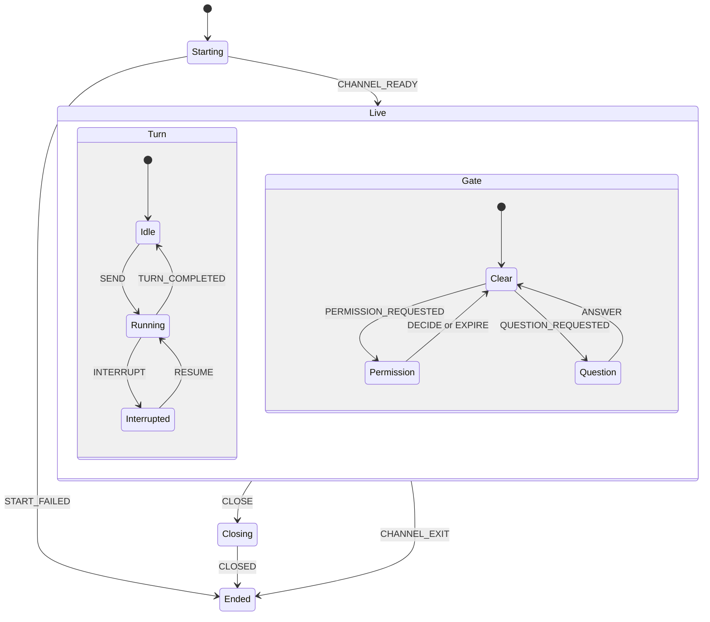
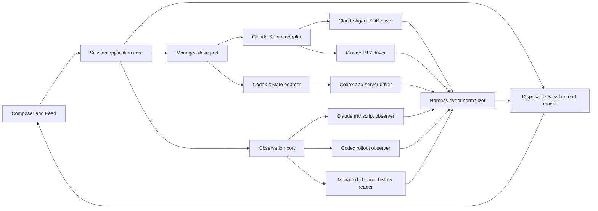

# Argo session connection architecture

Date: 2026-09-21

Status: Proposed direction

Scope: Claude, Codex, managed Sessions, and watched Sessions

## Decision

Argo will keep one Session domain and two separate paths around it:

1. A managed connection drives a live agent that Argo owns.
2. A watcher discovers and reads a Session that Argo does not own.

For Claude, the Agent SDK will be the primary managed connection. The existing PTY connection will remain a tested fallback. A PTY is a pseudo-terminal that runs the real interactive Claude Code interface.

If Anthropic restricts the SDK path, Argo will select the PTY adapter for new channels. Raw `stream-json` will not be a third production adapter.

For Codex, `codex app-server` will remain the managed connection. Argo will consume its complete event stream for live managed Sessions.

Transcript files will remain part of the architecture. They will supply history and reconciliation for managed Sessions. They will remain the main observation source for watched Sessions.

XState will own only the live connection flows that Argo controls. It will not own watched Session status or vendor transcript facts.

## Direct answer: Agent SDK or raw `stream-json`?

Raw `claude --output-format stream-json` has a policy advantage. Anthropic explicitly permits a third-party product to run the unmodified Claude Code binary with the user's own login.

Argo accepts that trade-off and chooses the Agent SDK for its cleaner programming interface. The PTY adapter provides the subscription-compatible fallback if the SDK path becomes unavailable.

The Agent SDK gives Argo an official library boundary. It provides typed messages, permission callbacks, custom tools, session controls, and cancellation. It also hides some process and protocol work that Argo otherwise owns.

Raw `stream-json` gives Argo direct control of the child process and the wire format. It reduces dependence on an SDK release. It also makes the move between structured input and a PTY easier because both paths launch the same executable.

Argo will support two Claude drivers:

- `ClaudeSdkDriver` for the normal managed experience.
- `ClaudePtyDriver` for the interactive fallback.

The SDK and `claude -p` share a billing-policy risk because both are headless. Their authentication rules are not the same. If Anthropic restricts headless subscription use again, Argo can select the PTY driver for new channels.

Argo must not switch drivers during a Turn. A Turn is one user request and its agent response. If the SDK fails after a Turn starts, Argo will close that channel, reconcile the Session record, and resume through the PTY at the next Turn boundary.

## Why the Agent SDK is the primary Claude driver

The SDK is the primary driver when these conditions are true:

- The user supplies an API key or supported cloud-provider credential, or Anthropic approves the subscription path for Argo.
- Its event set covers the Feed, permissions, questions, plans, tools, and usage data that Argo needs.
- Argo can package and update it without losing Claude Code configuration behavior.

It gives Argo these benefits:

- Typed events replace local parsing of a command-line stream.
- `canUseTool` and SDK hooks replace parts of the custom socket and hook bridge.
- SDK session operations support resume, fork, and history workflows.
- Custom tools can run through one supported integration.
- Errors and cancellation use a programming interface instead of terminal control bytes.

It also creates these costs:

- The SDK becomes a direct dependency of the desktop app.
- SDK and Claude Code releases can move at different speeds.
- Some Claude Code configuration, hook, or plugin behavior can differ from the interactive product.
- A headless billing policy change can disable this path for subscription users.
- The adapter still needs strict boundary validation. TypeScript types do not validate runtime data.

## Why raw `stream-json` is not a third adapter

Raw `stream-json` runs the unmodified Claude Code binary. The user completes Claude Code's own sign-in flow, and Argo never collects or stores the credential.

This path gives Argo these benefits:

- It matches Anthropic's documented third-party product rule.
- It uses the user's Claude subscription under the current billing policy.
- It preserves Claude Code configuration, plugins, hooks, and MCP servers.
- It keeps a child-process seam between Argo and the vendor runtime.
- It stays close to the PTY fallback because both paths launch the same binary.

The SDK already provides the structured channel that Argo needs. A separate raw stream adapter duplicates lifecycle, event, and permission work. Argo can keep raw stream probes for diagnostics and parity research without supporting a third production adapter.

## Why the PTY remains necessary

The PTY is not the preferred structured integration. It is the policy and compatibility fallback.

It preserves the interactive Claude Code surface. The paused headless billing proposal did not name this surface. This fact is not a future policy guarantee. The PTY also preserves the user's installed Claude Code version, login, settings, plugins, and terminal behavior.

The PTY has real costs:

- Argo sends text with terminal control sequences.
- Argo interrupts with terminal keys.
- Argo routes permissions through a hook and local socket.
- Terminal output is presentation text, not a stable event model.
- A Claude Code interface change can break automation that reads the screen.

Argo already avoids the most fragile version of this design. It does not scrape the hidden terminal to build the Feed. It reads structured transcript records and uses hooks for live signals.

The fallback must keep that rule. The PTY drives the process. The transcript and explicit hooks observe it.

## Billing evidence

Anthropic currently says that the planned billing change for the Agent SDK, `claude -p`, and third-party apps is paused. These surfaces still draw from subscription limits for now. Anthropic also says that the policy remains under review.

The earlier research session ran a headless Claude command on this machine. The init event reported no API key source, and the account used a paid Claude subscription. This proves that subscription billing worked for that account at the time of the test. It does not create a future billing guarantee.

Argo must treat billing as a driver selection policy, not as a domain rule. The Session model must not know why Argo selected the SDK or PTY.

Billing behavior and permitted authentication are separate questions. Billing tells Argo which account pays. Authentication policy tells Argo which credentials a third-party product can use.

Anthropic permits a third-party product to run the unmodified Claude Code binary. Each user must sign in through Anthropic's flow with their own subscription, API key, or supported provider credential. The product must not collect, store, resell, or intermediate the credential.

Anthropic gives the Agent SDK a narrower rule. A third-party product that uses the SDK must use an API key or supported cloud provider. The product cannot route Free, Pro, or Max credentials through the SDK on the user's behalf unless Anthropic agrees otherwise.

Argo can use the raw CLI path under the published conditions and Commercial Terms. It does not need a separate authentication exception. Argo needs an agreement before it offers subscription authentication through its Agent SDK integration.

This policy does not change the architecture choice. Argo can build the SDK adapter first. At release, the SDK path must use a permitted credential. If subscription authentication is not permitted, the runtime selects the PTY adapter.

Before Argo starts a managed Claude Session, it will read the init event and expose the active credential source. If an API key takes precedence over the subscription, Argo will warn the user before the first paid Turn.

Sources: [Anthropic billing notice](https://support.claude.com/en/articles/15036540-use-the-claude-agent-sdk-with-your-claude-plan), [Claude Code legal and compliance](https://code.claude.com/docs/en/legal-and-compliance)

## Managed and watched Sessions

The current domain term is `external`. The product idea in this report calls that posture watched because the word describes what Argo does.

This report does not create two kinds of Session. A Session remains one durable resume-chain. Managed and watched are connection postures that can change during the life of the same Session.

| Property | Managed Session | Watched Session |
| --- | --- | --- |
| Live owner | Argo owns the connection | Another client owns it, or no client owns it |
| Read history | Yes | Yes |
| Read live updates | Yes, from the managed event stream | Best effort, from the external record |
| Send a Turn | Yes | No |
| Answer permission | Yes | No |
| Interrupt | Yes | No |
| Process health | Direct | Derived or unknown |
| Resume later | Yes | Yes, when no other live owner holds it |

A watched Session is not a failed managed Session. It is a useful read-only view with weaker guarantees.

Watched Sessions keep three product benefits:

- Work that starts outside Argo still appears in Argo.
- A Session remains visible after Argo or the agent process exits.
- Users do not lose continuity when they move between tools.

The UI must keep the postures distinct. A watched Session will show a read-only state and no live controls. When the user sends the next Turn and no other process holds the Session, Argo can reopen the chain as a new managed connection. Argo resumes the Session. It does not adopt the old process.

This direction matches the existing domain rule in `docs/domain/l2-session.md`: managed is the watched baseline plus a live channel and direct capabilities.

## Where XState belongs

XState will model flows whose transitions Argo owns. It will not model facts that Argo only observes.

This rule gives the architecture a clear split:

- Use XState for each managed connection because Argo starts it, sends commands, handles gates, and closes it.
- Do not use XState for a watched Session because the external harness owns its transitions.
- Keep Session status as a derived projection over observed and managed facts.
- Use XState for the lifecycle of the filesystem watcher, not for the Sessions that the watcher finds.

The accepted Project setup design in ADR-0046 supplies the pattern. One actor runs in the Electron main process. The renderer receives a validated projection and sends validated commands. The renderer does not own a second machine.

### One machine for each managed Harness adapter

Each managed Session will have one XState actor inside its Harness adapter:

- `claude-session-machine.ts` in the Claude adapter.
- `codex-session-machine.ts` in the Codex adapter.

These must remain two machines. ADR-0024 requires each Harness adapter to own its protocol and lifecycle. A shared machine in the Session domain puts Claude and Codex conditions back into shared code.

The Claude machine can invoke `ClaudeSdkDriver` or `ClaudePtyDriver`. Driver selection happens before the connection enters `Live`. The selected driver stays fixed for the life of that channel.

The Codex machine invokes `CodexAppServerDriver`.

Both machines can use the same Session status vocabulary. They do not share a vendor-neutral machine implementation.

### Managed connection statechart

The statechart needs three concerns: connection life, Turn life, and a user gate. A gate is a permission or question that blocks progress until the user answers.

`Turn` and `Gate` are parallel regions. A Turn can remain active while a permission blocks it. The Session status projection can then show `permission` without destroying the fact that the Turn is still running.

The final machine can add adapter-specific states for compaction and handoff. It must add them only when the adapter owns those transitions.

### Machine context and invoked actors

Machine context will contain serializable facts only:

- Session ID.
- Harness name.
- Selected driver kind.
- Current Turn ID.
- Pending permission or question ID.
- Compaction and handoff IDs when they apply.
- Last observed error as a validated data value.

Machine context will not contain an SDK client, child process, PTY handle, timer, socket, or JSON-RPC connection. XState invoked actors will own those disposable objects.

The connection actor will translate driver events into machine events. Stopping the machine will stop the invoked actor and release its resources.

XState `after` transitions will own permission expiry and watcher backoff. This removes detached timers and repeated status guards from mutable Session records.

### Persistence and restart

Managed connection machines will not persist their XState snapshots. A live channel cannot survive an Argo restart. A persisted `Running` state creates a false claim after the process dies.

After a restart, the durable Session returns as watched. The next Send can open a new managed actor and resume the chain.

Project setup is different. Its workflow position survives a restart, so ADR-0046 persists its actor. XState use does not imply that every machine needs persistence.

### IPC and renderer rule

The renderer will not receive raw XState snapshots or send raw XState events. Each adapter will project the actor state into the existing validated Session contract.

The renderer can keep local view state such as an open panel or scroll position. It will not own connection, Turn, gate, retry, or resume state.

This keeps the main process authoritative and avoids a second state machine in React. Argo does not need `@xstate/react` for this design.

### Watched Session rule

A watched Session will not get an XState actor for its apparent status. Its status comes from transcript records, process evidence, and the honesty-tier rollup.

An XState machine in that path implies that Argo caused transitions that another process caused. It also creates a second source of truth beside the transcript.

The watcher mechanism itself is a good XState candidate. One actor for each watched root can own `Watching`, `Reopening`, `Settling`, and `Closed`, with delayed retry transitions. The actor reports watcher health. It does not report Session truth.

### Other useful XState actors

Two other flows fit the same rule:

- Account sign-in. One main-process actor can own device-code request, polling, cancellation, expiry, success, and failure. The snapshot does not persist because the device code expires.
- Project setup. ADR-0046 already accepts one durable actor for each Project. It owns planning, approval, application, interruption, and recovery.

Composer drafts, Feed geometry, Session status rollup, and adapter routing do not need XState. They are collections, continuous measurements, pure projections, or lookups. A state machine adds a second owner without removing complexity.

### XState testing and visualization

Machine tests will assert real outcomes, not only state names. Examples include a denied permission, a stopped process, a reopened watcher, and a released ownership claim.

`xstate/graph` can generate paths through the machine. Each generated path still needs an outcome assertion.

Argo can generate Mermaid diagrams from the machine graph for architecture records. It will not send Session IDs or repository paths to the hosted Stately Inspector. A local inspector can be considered after its data path is established.

## Clean architecture

The architecture separates the durable Session from the temporary connection.

### Session application core

The core owns product actions and domain rules. It knows about Session identity, posture, capabilities, Turns, permissions, and status. It does not know about JSON-RPC, terminal bytes, SDK objects, XState states, or transcript paths.

### Managed drive port

The drive port defines actions on a live Session. Its operations include start, resume, send, interrupt, answer, decide, rename, compact, and close.

Each driver reports a capability value. A capability value is a fixed description of what that driver can do. The UI reads it before it draws a control.

The port must not force fake parity. For example, a driver can report that it supports session fork but does not support compaction.

### Observation port

The observation port discovers Sessions and reads their durable records. It can list, read history, tail changes, and report source health.

It has no send or permission methods. This keeps watched logic out of the managed driver and prevents accidental control of a process that Argo does not own.

### Harness event normalizer

Each adapter converts vendor events into Argo records. The normalizer records the source and honesty tier for each fact.

It also deduplicates a live event when the same event later appears in a transcript. The managed event gives the user a fast live view. The durable record confirms or replaces it.

### Disposable Session read model

Argo can keep a normalized Session index in its own SQLite database. The index is disposable because the vendor record remains the source of truth.

For a managed Session, Argo can persist enough normalized events to restore the Feed after a restart. It must still reconcile against the vendor history before it claims that the index is complete.

This use follows ADR-0043. Durable Argo settings and disposable external indexes stay in separate tables.

## Claude data flow

### Managed with the Agent SDK

1. Argo starts or resumes the Session through `ClaudeSdkDriver`.
2. The SDK emits live structured events.
3. The Claude adapter validates and normalizes each event.
4. Argo updates the Feed and Session status from the managed channel.
5. The transcript observer confirms durable history and fills any gaps.

The live SDK stream is the primary source during the Turn. The transcript is the durable reconciliation source after the Turn.

### Managed with the PTY

1. Argo starts or resumes the interactive Claude process in a hidden PTY.
2. Argo sends input and terminal controls through the PTY.
3. Hooks report permissions and early display text.
4. The transcript observer builds the durable Feed.
5. Process exit supplies direct lifecycle state.

The PTY bytes are not the Feed protocol.

### Watched Claude Session

1. The observer discovers `~/.claude/projects` transcript files.
2. It stitches files into the logical resume-chain.
3. It tails changes and updates the read model.
4. It exposes no drive capabilities.

The Agent SDK session browser can improve listing and history operations. Argo must still keep transcript support because the SDK session helpers read the same Claude Code records.

Sources: [Claude Code CLI reference](https://docs.anthropic.com/en/docs/claude-code/cli-usage), [Agent SDK overview](https://platform.claude.com/docs/en/agent-sdk/overview), [Agent SDK session browser](https://platform.claude.com/docs/en/cookbook/claude-agent-sdk-05-building-a-session-browser)

## Codex data flow

### Managed Codex Session

Argo already uses the correct transport: `codex app-server` over JSON-RPC.

The clean design will use the app-server stream for all live managed facts:

- `thread/status/changed` for thread status.
- `turn/started` and `turn/completed` for Turn boundaries.
- `item/started` and `item/completed` for structured Feed items.
- Delta events for assistant text, reasoning, commands, and patches.
- Server requests for approvals and questions.
- `thread/name/updated` for the Codex title.
- `thread/tokenUsage/updated` for usage and the context window.

Argo currently handles only part of this event set and rebuilds much of the Feed from rollout files. That is the main Codex retrofit to remove.

On reconnect, Argo can use `thread/read` with full Turns for managed history. It can use `thread/list` for names and discovery metadata. The app-server stream remains the live source.

### Watched Codex Session

A separate app-server process does not publish events for a thread that another process runs. `thread/read` can poll the stored thread, but the earlier probe found incomplete items and incorrect live status for some writers.

The rollout observer must therefore remain the primary watched path. Argo can combine it with `thread/list` metadata when that data is available.

Argo must not call `thread/resume` to observe a live external thread. Resume takes ownership and can take the writer lock.

Sources: [Codex app-server client](https://github.com/openai/codex/tree/main/codex-rs/app-server-client), [Codex thread store](https://github.com/openai/codex/tree/main/codex-rs/thread-store)

## What other products do

The market does not use one common transport. It does show a strong split between live control and history.

| Product | Claude live path | History or watched path | Codex path | Evidence |
| --- | --- | --- | --- | --- |
| Conductor 0.85 | Agent SDK over native Claude Code | Internal session store | `codex app-server` | Local bundle inspection, [subscription update](https://www.conductor.build/blog/claude-subscription-update), and [FAQ](https://www.conductor.build/docs/faq) |
| Vibe Kanban | Raw `stream-json` over child stdio | Separate review and record readers | `codex app-server` | [Source repository](https://github.com/BloopAI/vibe-kanban) |
| Crystal | Raw `stream-json` over child stdio | Its own task records | Not established | [Source repository](https://github.com/stravu/crystal) |
| Sculptor | Raw `stream-json` in a container | Transcript lookup for resume | Other adapters use their own protocols | [Source repository](https://github.com/imbue-ai/sculptor) |
| HumanLayer | Raw `stream-json` from its daemon | Its own Session records | Not established | [Source repository](https://github.com/humanlayer/humanlayer) |
| Terragon | Raw `stream-json` | Finds and repairs Claude transcripts | Not established | [Source repository](https://github.com/terragon-labs/terragon-oss) |
| Claudia | Raw `stream-json` for live Turns | Reads Claude transcripts for history | Not established | [Source repository](https://github.com/getAsterisk/claudia) |
| cui | Raw `stream-json` for live Turns | Reads Claude transcripts for history | Not established | [Source repository](https://github.com/wbopan/cui) |
| Claude Code UI | Agent SDK for chat and PTY for its shell | Watches Claude transcript files | Not the focus of the reviewed path | [Source repository](https://github.com/siteboon/claudecodeui) |
| Happy | Agent SDK | Watches Claude transcript files | ACP support | [Source repository](https://github.com/slopus/happy) |
| Zed with Claude | Agent SDK through `claude-code-acp` | ACP session updates | ACP for supported agents | [Claude Code ACP](https://github.com/zed-industries/claude-code-acp) |
| Claude Squad | Real Claude TUI in tmux | Captures terminal panes | Not established | [Source repository](https://github.com/smtg-ai/claude-squad) |
| Uzi and ccmanager | Real Claude TUI in tmux or a PTY | Hooks or terminal panes | Not established | [Uzi](https://github.com/devflowinc/uzi), [ccmanager](https://github.com/kbwo/ccmanager) |

The pattern is consistent:

- Raw `stream-json` drives most hidden Claude agents in the reviewed open-source products.
- Agent SDK integrations exist in Conductor, Claude Code UI, Happy, and Zed's Claude adapter.
- Transcript files often supply history, discovery, resume checks, and repair.
- Terminal scraping appears mainly in products that show or multiplex the real terminal.
- Codex integrations use `codex app-server` when they need a first-party live protocol.

Conductor publicly says that it uses the Agent SDK with the user's Claude subscription and that it is working with Anthropic. Its public pages do not state whether it has a separate agreement. Argo cannot infer permission from Conductor's implementation.

Argo is unusual because its current managed Claude Feed depends on the transcript during the live Turn. A raw structured stream removes that live dependency without moving authentication into the SDK.

Watched Sessions are less common as a first-class product feature. Several products list or import old Sessions, but fewer keep an always-synchronized read-only view of work from other clients. Argo can keep that feature as a continuity layer without forcing it into the managed architecture.

## Driver selection policy

Driver selection belongs in the Claude adapter. The product core asks for a managed Claude channel and receives the selected driver plus its capabilities.

Use this order for a new or resumed channel:

1. Use the Agent SDK when its authentication path is permitted and healthy.
2. Use the PTY when the SDK is unavailable, restricted, or disabled by the user.
3. Refuse the start if neither path is healthy. Keep the draft and explain the failure.

Argo must record the selected driver on the live channel. It does not store the driver as a permanent property of the Session.

The selection decision needs these inputs:

- Claude Code and Agent SDK versions.
- Credential source.
- Billing eligibility.
- Required capabilities for the requested action.
- User policy for headless execution.
- Health of the executable and plugin bridge.

## How far Argo is from this design

Argo already owns much of the correct structure:

- One Session drive port with Claude and Codex adapters.
- A Claude PTY driver.
- A Codex app-server driver.
- Transcript discovery and resume-chain assembly.
- Managed and external postures in the domain.
- Direct, derived, and convention honesty tiers.
- A SQLite plan for durable state and disposable indexes.

The remaining work is concentrated in the adapter and projection layers:

| Gap | Size | Reason |
| --- | --- | --- |
| Add `ClaudeSdkDriver` | Medium | New primary driver behind an existing seam |
| Add driver selection and capability reporting | Small to medium | The port already declares adapter capabilities |
| Read the full Codex managed event set | Large | Feed projection currently returns to rollout files for many items |
| Make live channel events primary for managed Sessions | Large | Requires stable identifiers and deduplication with transcripts |
| Separate the observation port from the drive port | Medium | The concepts exist but ownership is spread across Session code |
| Make watched posture explicit in the UI | Small to medium | The domain already calls it `external` |
| Detect Claude credential source | Small | The init event exposes `apiKeySource` |
| Repair interrupted Claude transcripts before resume | Medium | Needs a safe and tested record repair rule |
| Replace direct Codex title SQLite reads | Small | `thread/list` exposes the native name |
| Add parity tests for SDK and PTY | Medium | Both drivers must produce the same Argo outcomes |

This is not a whole-app rewrite. The control seam is already close to the target. The larger change is the managed Feed projection, especially for Codex.

## Migration plan

### Phase 1: make the boundary explicit

- Keep the domain values `managed | external` until a separate naming decision changes them.
- Introduce a read-only observation port.
- Move every drive capability behind the managed drive port.
- Add one capability value for each driver.

### Phase 2: make Codex native

- Map the full app-server event set into Argo records.
- Use channel events as the live source for managed Codex Sessions.
- Use `thread/read` for managed recovery.
- Keep rollout tailing for watched Codex Sessions.
- Move native title reads from `state_5.sqlite` to `thread/list`.

### Phase 3: add the Claude Agent SDK driver

- Implement the SDK adapter behind the existing drive port.
- Make sure that all SDK events cross a runtime validation boundary.
- Compare SDK and PTY outcomes with the same adapter contract tests.
- Run the SDK path in shadow mode before it becomes the default.

### Phase 4: keep the PTY fallback healthy

- Keep a visible setting for the PTY compatibility path.
- Keep automated PTY tests so the fallback does not decay.
- Do not remove transcript observation.

### Phase 5: improve watched Sessions

- Make the read-only posture clear in the Roster and Feed.
- Show source health and last update time.
- Keep watched Sessions out of permission and interruption flows.
- Resume into a new managed channel only after the ownership test passes.

## Risks and decision triggers

Argo will revisit the preferred Claude driver when one of these events occurs:

- Anthropic activates separate billing or blocks subscription use for the Agent SDK.
- Anthropic changes the permitted authentication paths for Agent SDK integrations.
- The SDK cannot match required Claude Code plugin or hook behavior.
- SDK packaging creates an unacceptable desktop release risk.
- Raw `stream-json` exposes a required feature before the SDK.
- Claude Code adds a stable local server protocol that replaces both paths.

Argo will revisit watched Codex observation when Codex provides a supported subscription or broadcast API for externally owned threads. Until then, rollout files remain necessary.

## Final recommendation

Build the architecture around one durable Session, one read-only observation port, and one managed drive port.

Use the Claude Agent SDK as the primary managed driver. Keep the current PTY adapter as a tested fallback. If the SDK path becomes restricted or unavailable, select the PTY adapter for new channels.

Use `codex app-server` as the full live source for managed Codex Sessions. Keep transcript and rollout observers for watched Sessions and for durable reconciliation.

Keep watched Sessions. They are not the main interaction path, but they preserve continuity across tools and app restarts. Their weaker guarantees must remain visible in the domain and the UI.

## Sources

- [Anthropic Claude Code CLI reference](https://docs.anthropic.com/en/docs/claude-code/cli-usage)
- [Anthropic Agent SDK overview](https://platform.claude.com/docs/en/agent-sdk/overview)
- [Anthropic Agent SDK session browser cookbook](https://platform.claude.com/docs/en/cookbook/claude-agent-sdk-05-building-a-session-browser)
- [Anthropic billing notice for Claude plans](https://support.claude.com/en/articles/15036540-use-the-claude-agent-sdk-with-your-claude-plan)
- [Claude Code legal and compliance](https://code.claude.com/docs/en/legal-and-compliance)
- [OpenAI Codex app-server client](https://github.com/openai/codex/tree/main/codex-rs/app-server-client)
- [OpenAI Codex thread store](https://github.com/openai/codex/tree/main/codex-rs/thread-store)
- [Conductor Claude subscription update](https://www.conductor.build/blog/claude-subscription-update)
- [Vibe Kanban source](https://github.com/BloopAI/vibe-kanban)
- [Crystal source](https://github.com/stravu/crystal)
- [Sculptor source](https://github.com/imbue-ai/sculptor)
- [HumanLayer source](https://github.com/humanlayer/humanlayer)
- [Terragon source](https://github.com/terragon-labs/terragon-oss)
- [Claude Code UI source](https://github.com/siteboon/claudecodeui)
- [Happy source](https://github.com/slopus/happy)
- [Claudia source](https://github.com/getAsterisk/claudia)
- [cui source](https://github.com/wbopan/cui)
- [Claude Squad source](https://github.com/smtg-ai/claude-squad)
- [Uzi source](https://github.com/devflowinc/uzi)
- [ccmanager source](https://github.com/kbwo/ccmanager)
- [Claude Code ACP source](https://github.com/zed-industries/claude-code-acp)
- `docs/adr/0024-session-drive-port-two-adapters.md`
- `docs/adr/0026-a-resume-chain-can-be-resumed.md`
- `docs/adr/0042-a-codex-title-is-read-from-codex-app-state.md`
- `docs/adr/0043-sqlite-owns-per-machine-state-and-indexes.md`
- `docs/domain/l2-session.md`
- `docs/domain/honesty-tier.md`
