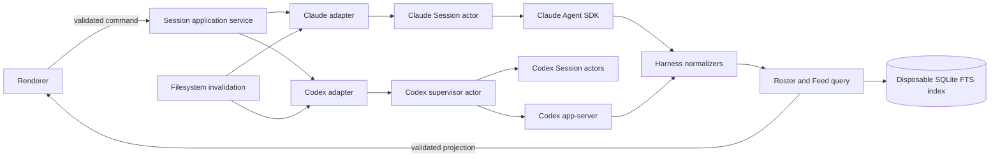

# Argo Session connection architecture

Date: 2026-09-21

Status: Final proposed direction

Scope: Sessions, Project setup, Accounts, Connections, Tickets, storage, and publication

## Decision

Argo will use vendor-supported programming interfaces as the only source for Session content.
Claude will use the Claude Agent SDK. Codex will use `codex app-server`.

Argo will keep two Session paths:

1. A managed connection drives a live Session that Argo owns.
2. A watched connection reads a Session that Argo does not own.

The paths share validated product projections, not lifecycle or transport code. Each Harness owns
its adapter. Shared code contains only contracts, application rules, and projections.

A Session is keyed by `(Harness, native Session ID)`. Native IDs replace reconstructed chains,
transcript paths, and temporary Session IDs.

PTY control and raw `stream-json` are deferred. They will not shape the first contract. The
rewrite will remove transcript and rollout parsers, marker parsing, legacy polling, compatibility
code, and data migration.

The future Claude PTY fallback will live in one self-contained Claude Harness driver module. The
active SDK runtime will not import or start it. Shared Session contracts, XState machines, IPC,
projections, Roster, Feed, onboarding, and UI will contain no PTY-specific branch.

## Authority and posture

`managed | watched` replace `managed | external`.

| Property | Managed | Watched |
| --- | --- | --- |
| Live channel | Argo owns it | Argo owns no live channel |
| History | Vendor API | Vendor API |
| Updates | Managed event stream | Filesystem invalidation, then a vendor API read |
| Drive actions | Adapter capabilities apply | None |
| Resume | Current channel or native resume | Native resume after an ownership check |

A watched Session is a useful read-only view, not a failed managed Session. Sending to an
eligible watched Session opens a new managed channel. Argo never adopts another process.

The live stream supplies immediate facts. Vendor history supplies durable reconciliation. Argo
deduplicates a native event that arrives through both paths.

The filesystem is an invalidation source only. A change tells Argo to call the vendor API again.
Argo never reads transcript or rollout content. If an API omits a fact, Argo reports it as unknown.

Claude and Codex keep conversation history in their own vendor-managed local stores. Argo does not
copy full transcripts into SQLite. SQLite stores only Argo-owned records and a disposable search
projection populated through vendor reads. Resuming an older Session sends its native ID to the
SDK or app-server; Argo does not reconstruct the conversation itself.

## SQLite boundary

Normal durable repositories use the pinned `drizzle-orm/node-sqlite` adapter. Their schema and
types come from the domain-owned Drizzle tables. Direct SQLite is reserved for FTS5, required
PRAGMAs, and other operations that Drizzle cannot express. Adapter contract tests protect that
pinned runtime before it changes.

## Architecture

The application service knows Session identity, posture, capabilities, and product actions. It
does not know SDK objects, JSON-RPC, XState state names, file formats, or renderer components.

Each adapter validates vendor data at its boundary. It maps data into shared Session, Turn,
Message, Thought, Tool Call, Permission, Plan, Usage, and status projections.

The managed drive contract includes start, resume, send, steer, interrupt, decide, answer,
rename, compact, and close. Each adapter declares supported capabilities. The observation
contract lists Sessions, reads Feed history, reports health, and reacts to invalidation. It has no
drive action.

## Claude adapter

`ClaudeSdkDriver` will be the only managed Claude driver in this rewrite. It will start, resume,
observe, and stop Sessions through the Agent SDK. Argo will validate every SDK event.

The official session-browser example documents local history helpers such as `listSessions()` and
`getSessionMessages()`. These helpers are version-specific, so Argo must pin and contract-test the
SDK version. The example exposes offset-and-limit pagination, but the current core sessions guide
does not make those helpers part of its stable contract. If the pinned SDK cannot provide them,
the adapter is unavailable until Argo supports a vendor-approved replacement.

The watched path uses SDK history helpers. A filesystem watcher observes the Claude store only to
trigger another SDK read. The SDK provides no external change subscription for Sessions owned by
another process, so watched updates are best effort. The UI shows source health and the last
successful refresh.

Sources: [Agent SDK overview](https://code.claude.com/docs/en/agent-sdk/overview),
[Agent SDK sessions](https://code.claude.com/docs/en/agent-sdk/sessions), and
[Agent SDK session browser](https://platform.claude.com/cookbook/claude-agent-sdk-05-building-a-session-browser).

### Claude authentication

Argo's product contract is Claude subscription OAuth only. Argo will never accept an API key,
select API billing, or fall back to an API key when subscription authorization fails.

Anthropic currently says that Agent SDK and third-party app usage draws from subscription limits
because its announced billing change is paused. Argo will use that current subscription path.

The Agent SDK overview separately says that third-party products need prior approval to offer
Claude.ai login or rate limits. Argo will track that statement as a distribution-policy risk, not
an implementation or release gate. If Anthropic later blocks subscription access or changes its
metering, the SDK adapter becomes unavailable and the isolated PTY fallback becomes the next
adapter. Argo will never change the billing source to make the SDK work.

Sources: [Claude plan usage](https://support.claude.com/en/articles/15036540-use-the-claude-agent-sdk-with-your-claude-plan)
and [Agent SDK authentication policy](https://code.claude.com/docs/en/agent-sdk/overview).

## Codex adapter

Argo will run one `codex app-server` process in the Electron main process. One supervisor actor
owns its process, transport, initialization, reconnect policy, and JSON-RPC client. A child actor
owns each managed Session lifecycle and sends typed requests through the supervisor.

The adapter will use supported events for thread status, Turn boundaries, item boundaries,
content deltas, approvals, questions, names, and usage. It will use `thread/read` and list methods
for recovery and history. Experimental Turn and item pagination require a version-pinned
capability test.

A separate app-server does not receive live events for every thread that another process owns.
The watched path therefore uses filesystem invalidation followed by `thread/list` or
`thread/read`. Argo will not parse rollout files, read Codex's private SQLite schema, or resume a
thread only to observe it.

Source: [Codex app-server](https://developers.openai.com/codex/app-server/).

## What other products do

There is no common transport across agent products. The useful pattern is separation: one adapter
owns live control, while a supported vendor read model restores history.

| Product | Live connection | History and recovery | Lesson for Argo |
| --- | --- | --- | --- |
| Codex IDE extension | `codex app-server` | App-server `thread/read` and list methods | Subscribe while active, unsubscribe when idle, and read vendor history after reconnect. Do not replay uncertain input. |
| Conductor | Claude Agent SDK | Product-owned Session view | SDK use exists in a shipped desktop product, but Conductor's public Anthropic relationship does not grant Argo the same authorization. |
| Vibe Kanban | Claude `stream-json` child process | Separate record readers | Raw structured CLI output is viable, but it couples the product to CLI transport and storage details. |
| Claude Code UI | Agent SDK plus a PTY shell | Watches Claude's local history | A hybrid is possible, but its history watcher still depends on vendor files. |
| Claude Squad and Uzi | Real TUI in tmux or a PTY | Terminal pane capture | TUI multiplexing preserves native login and behavior, but terminal state is a weaker product protocol. |

Argo chooses the SDK/app-server pattern first. A PTY/TUI adapter stays a later fallback if the
Claude SDK authorization gate cannot be cleared. Watched Sessions remain an Argo feature even
though most products treat old Sessions as an archive rather than a continuously refreshed view.

Sources: [Conductor subscription update](https://www.conductor.build/blog/claude-subscription-update),
[Vibe Kanban](https://github.com/BloopAI/vibe-kanban),
[Claude Code UI](https://github.com/siteboon/claudecodeui),
[Claude Squad](https://github.com/smtg-ai/claude-squad), and
[Uzi](https://github.com/devflowinc/uzi).

## XState ownership

Each managed Claude Session has one ephemeral main-process actor. Codex has one supervisor and
one ephemeral child actor for each managed Session. These actors own connection, Turn, gate,
recovery, and close transitions.

Actor context contains serializable identifiers and validated facts only. It never contains a
client, process, socket, timer, stream, `AbortController`, or JSON-RPC connection. Invoked actors
create and own those disposable objects.

Argo will not persist live Session actor snapshots. A channel cannot survive an application
restart. After restart, the vendor Session is watched until the user resumes it.

Watched Sessions have no lifecycle actor. If a Claude resume returns a different native ID because
the original Session is active elsewhere, Argo creates a new managed Roster row and leaves the
watched row unchanged. It never changes one native identity into another.

IPC carries validated product commands and revisioned projections. It never carries raw XState
events or persisted snapshots. React can keep view state such as scroll position or an open
popover. It will not own connection, Turn, retry, gate, or resume state.

The renderer will remove optimistic Feed rows, optimistic Turn state, temporary Session IDs, and
the pending-Turn drain. Vendor events and history are the only Feed and Turn truth. The composer
keeps drafts and attachments until command acceptance. Uncertain delivery causes reconciliation
and an explicit retry, never an automatic resend.

### Accounts and sign-in

Accounts and Connections are Drizzle records, not actors. Tokens remain in the OS keychain.

One temporary `accountSignInMachine` in the main process owns GitHub or Linear OAuth for the whole
application. It models start, user action, completion, save, expiry, cancellation, failure, and
replacement. It stores serializable request metadata only. Invoked actors own tokens, PKCE
verifiers, provider clients, and browser handles. Its snapshot is not persisted.

Claude and Codex use Harness-specific temporary sign-in actors. The Accounts screen shows them
under `Agent sign-ins`, but they are not Account entities. `ProjectSetup` waits for Harness
readiness. It does not own sign-in.

### Tickets

Tickets are provider-owned query data. Connections are Argo-owned records. Neither is an actor.

One `ticketObserverMachine` per Connection owns initial sync, refresh, reconnect, backoff,
authentication failure, and periodic reconciliation. It stores observer state, not Ticket data.

GitHub webhook forwarding can be a fast invalidation path where Argo enables it. GitHub documents
the forwarder for testing and development only, so API reconciliation remains the correctness
floor. Linear provides HTTPS webhooks, not a desktop WebSocket. Argo will poll Linear until it has
a secure cloud relay that can authenticate, queue, and route webhook events.

Every push event is an invalidation signal. The observer reads the provider API before it changes
Ticket truth.

Ticket field writes keep their existing optimistic patch and rollback behavior. This is separate
from the removed Session Feed and Turn optimism.

Sources: [GitHub webhook forwarding](https://docs.github.com/en/webhooks/testing-and-troubleshooting-webhooks/using-the-github-cli-to-forward-webhooks-for-testing)
and [Linear webhooks](https://linear.app/developers/webhooks).

## Drizzle and SQLite

One SQLite database under `userData` stores Argo-owned state and disposable indexes. Durable
tables include Project, Account, and Connection registries, user links, pins, pinned order,
unread state, ownership leases, and Project setup records. Disposable tables include Session
search and indexing progress.

Table definitions live beside their domains. One Drizzle configuration collects them into one
ordered migration history. Drizzle Kit generates normal schema changes and indexes. Custom SQL
migrations create FTS5 tables, triggers, and unsupported data changes. One startup runner applies
the history before repositories open.

Argo will keep direct `node:sqlite` repositories until the Drizzle `node:sqlite` packages are
stable. The official setup currently installs `drizzle-orm@rc` and `drizzle-kit@rc` for this
driver.

Sources: [Drizzle with Node SQLite](https://orm.drizzle.team/docs/get-started/node-sqlite-new)
and [Drizzle custom migrations](https://orm.drizzle.team/docs/kit-custom-migrations).

This is a development cutover with no users. Argo will reset the current database. It will not
migrate legacy IDs, JSON state, index data, or claims. It will delete legacy readers, writers,
migrations, recovery code, flags, and tests. The new schema starts with transactional migration,
backup, and recovery behavior.

## Unified Roster

The renderer requests one Argo page. Each adapter hides its native pager and returns rows in
descending activity order. The application service merges buffered rows with a stable
`(activity, Harness, native Session ID)` order and returns one opaque cursor.

Normal updates do not stale the cursor. Argo patches visible rows and keeps paging from held
provider positions. A cursor is truly stale only when its position expires, iterator state is
lost, or a vendor rejects it. Argo then refreshes in the background and preserves the visible row
and pixel offset as the scroll anchor.

A provider failure does not hide the other provider's rows. The Roster shows available rows and
a provider-specific Retry action.

Pinned Sessions appear under `Pinned Sessions` in manual order. Users can drag pinned rows to
reorder them. Unpinned Sessions appear under `Sessions` in activity order. Both headers and all
rows belong to one virtual list. Pinning, reordering, refresh, and search preserve the anchor.

Argo stores pins under `(Harness, native Session ID)`. Vendor pins and tags remain separate.
Reorder writes use one SQLite transaction and a revision. A missing pinned Session shows an
`Unavailable` row with Unpin until a complete vendor scan confirms deletion.

## Search

Search covers native ID, vendor title, summary, and message content. Codex title search is not
enough, and Claude has no common full-content endpoint. A disposable SQLite FTS5 index preserves
full-content search. Only vendor APIs populate it.

First load has two phases:

1. The Roster shows an indeterminate `Discovering Sessions` bar while Argo finds all Project
   Sessions, including archived Sessions.
2. It shows `Indexing Sessions · x of y` while Argo indexes changed or missing Sessions.

The bar sits above the Roster. Indexing never blocks Roster, Feed, or managed work. Search returns
known matches during indexing and does not show a final empty state until available Harnesses
finish.

The disposable progress record lets an interrupted run resume. Later runs compare vendor
metadata and index only new or changed Sessions. Small updates stay quiet. A large bar returns for
first indexing, rebuild, or a substantial backlog. One Harness failure does not stop the other.

Search keeps both list headers. Matching pins keep manual order. Matching unpinned Sessions keep
activity order. Content matches include a vendor-derived excerpt when available.

## Project setup and onboarding

Harness readiness has four states: `not installed | signed out | ready | blocked by policy`. If no
supported Harness is ready, setup shows the supported Harnesses and starts the selected vendor's
cloud OAuth sign-in. It never offers API billing. Setup then returns to the same selected Harness.
If authorization expires during work, the Attempt becomes interrupted, sign-in runs globally, and
setup reconciles and resumes the same Attempt and Session.

One durable `ProjectSetup` actor per Project runs in the main process. It owns every durable
transition. The renderer sends validated commands and receives revisioned projections. The actor
uses the shared Session service and never imports a Harness SDK.

An invalid or stale command does not increment the actor revision and does not persist. The
renderer rejects a projection older than the latest revision it has rendered. A durable transition
caused by an invoked actor is persisted by the same transaction path as a user command.

One agent Attempt uses the same selected Harness and native Session for read-only planning and
sandboxed application. Plan revisions remain in that Session. If the Session cannot resume, Argo
creates a new numbered repair Attempt and carries forward the evidence.

The setup worktree is the sandbox. Routine writes inside it do not prompt. Network access is
allowed. Tool caches live under `.argo/cache`, and setup adds that path to git ignore rules. A
write outside the worktree needs approval for the exact effect. Inside the worktree, the agent asks
the user only when it lacks a product decision or needs clarification. It does not request approval
for each tool call. Argo never grants blanket access outside the sandbox.

The durable actor stores workflow position and stable record IDs. Temporary effect actors own
live subscriptions and disposable objects. Restart maps an active effect to `interrupted`. Resume
first reconciles the Session and worktree.

Onboarding will remove the 500 millisecond polling controller, process-memory run store,
`liveMessages()` aggregation, completion markers, fenced JSON parsing, blanket approvals, and
separate onboarding run identity.

### Review, validation, and publication

After application, Argo runs one code-review pass from the latest base. Independent Standards and
Spec subagents review the accepted plan and repository rules. The setup Session fixes accepted
findings once. There is no second AI review. Argo then runs deterministic validation.

If manual verification is required, the user can confirm it or return to the same setup
conversation. Confirmation records the required evidence. Returning keeps the Attempt while the
Session can resume.

Argo records the exact final diff fingerprint. Final diff acceptance authorizes commit, push,
and creation of a draft pull request. It does not authorize merge.

Before publication, Argo refreshes the base, integrates it into the setup branch, and runs
deterministic validation again. A changed diff needs a new fingerprint and acceptance.

Publication is idempotent, which means that retrying it does not duplicate an external effect.
If GitHub is unavailable, Argo preserves the worktree and reports its path, branch, commit SHA,
base, completed steps, and exact manual push and pull-request steps. The user can paste a created
pull-request URL, which Argo validates before recording it. A pull request closed without merge
sets `Publication stopped` and retains the worktree.

The Project remains usable with a setup badge. The badge remains until required files reach the
remote default branch and validate in a temporary worktree. Pull request state is not
authoritative. Argo checks the remote default branch on application start, focus, and manual
refresh. Successful validation marks setup ready and removes finished setup worktrees. Failed
validation shows `Setup needs attention` and starts a repair Attempt without blocking the Project.

## Ownership and recovery

SQLite stores one lease per managed Session. It records the Harness, native ID, process, window,
acquisition time, and heartbeat. Acquisition and release are atomic. Argo rechecks vendor
liveness before it reclaims a lease or resumes a watched Session.

A lost channel enters bounded recovery with backoff. Recovery reconnects, reads vendor history,
and restores observation. It never resends a Turn. Exhausted recovery stops the actor, releases
the lease, leaves the Session watched, keeps the draft, and offers Retry.

## Migration phases

1. Add domain-local Drizzle schemas, one migration history, the startup runner, FTS5, durable
   tables, backups, and the clean database reset.
2. Adopt native IDs, `managed | watched`, validated contracts, the Session service, leases, and
   non-optimistic renderer behavior.
3. Add the Codex supervisor and Session actors. Use complete app-server events and API history.
   Remove rollout and private SQLite reads.
4. Add subscription-only Claude authorization, managed actors, SDK history, and watched
   invalidation. Disable the PTY runtime path, but keep its runtime dependencies and adapter seam
   for the later fallback. Isolate that seam in one dormant Claude Harness driver module. Remove
   hook sockets, transcripts, and chain reconstruction.
5. Add the merged virtual Roster, stable refresh, partial failures, pins, ordering, FTS search,
   and indexing progress.
6. Add Account and Harness sign-in actors, Ticket observers, and the full Project setup,
   review, validation, and publication flow.
7. Delete obsolete adapters, parsers, indexes, JSON stores, aliases, compatibility migrations,
   flags, unrelated dead dependencies, and tests for removed behavior. Keep the PTY dependencies
   that the planned Claude fallback will use.

## Verification

Recorded vendor streams will test both adapters without a legacy backend. Machine tests will
assert outcomes such as denial, cancellation, recovery, lease release, OAuth expiry, and safe
publication retry.

Integration and packaged-app tests will cover Roster paging, Feed recovery, resume, search,
progress, pins, ordering, sign-in, Ticket refresh, Project setup, restart, and recovery.

Release targets will measure time to first rows, next page, and indexed results. They will also
measure anchor movement and count duplicate or skipped rows. Timings will contain no Session
content.

Internal cutover flags can exist while staged changes land. Every flag and old path must be gone
before release. An adapter failure shows Retry and diagnostics. It never falls back to parsing.

## ADR conflicts

This direction keeps ADR-0024's one-adapter-per-Harness boundary. It replaces that ADR's Claude
PTY decision, separate Agent SDK billing claim, and transcript observation rule.

It replaces ADR-0008's files-only store, transcript discovery, chain construction, and
file-derived liveness. ADR-0043 governs Argo-owned durable data and disposable indexes.

It keeps ADR-0013's no-Session-kinds rule and replaces `managed | external` with
`managed | watched`.

It keeps ADR-0026's rule that a channel is temporary and a Session can resume. It replaces chain
reconstruction, transcript identity, and transcript liveness with native IDs, leases, and vendor
checks.

It keeps ADR-0040's rule that origin does not gate resume. It replaces the ownership JSON ledger
and file/process liveness checks with SQLite leases and vendor liveness.

It supersedes ADR-0041's user-level compaction hook. Compaction comes from vendor events and
history.

It supersedes ADR-0042. Codex titles come from app-server, not `state_5.sqlite`.

It amends ADR-0043. Drizzle Kit owns schema generation, FTS5 is required, and vendor APIs rebuild
disposable indexes. Transcripts do not rebuild them.

It keeps ADR-0046's durable main-process actor and validated IPC. It replaces its separate
planning and application Sessions, routine worktree approvals, final-diff completion rule, and
publication boundary. One Session spans planning and application. Final acceptance authorizes
publication. Remote default-branch validation decides completion.

The coordinated domain-model update replaces `external`, transcript identity, chain
reconstruction, private title reads, and transcript-derived status with this direction.

## Risks and release constraints

- Anthropic can change third-party subscription policy or metering. Such a change triggers the
  isolated PTY fallback and never an API-key fallback.
- Version-specific Claude history helpers need pinned contract tests.
- Codex experimental history methods need capability tests and a supported fallback.
- Filesystem invalidation can miss changes. Application focus and manual refresh re-read vendor
  history without parsing files.
- GitHub forwarding is not a production service. Ticket correctness cannot depend on it.
- Linear polling costs latency and quota until Argo has a webhook relay.
- First indexing can take time. The nonblocking progress UI makes partial results explicit.
- Drizzle's `node:sqlite` runtime remains on release-candidate packages. Direct `node:sqlite`
  repositories remain until that changes.

## Sources

- [Anthropic Agent SDK overview](https://code.claude.com/docs/en/agent-sdk/overview)
- [Anthropic Agent SDK sessions](https://code.claude.com/docs/en/agent-sdk/sessions)
- [Anthropic Agent SDK session browser](https://platform.claude.com/cookbook/claude-agent-sdk-05-building-a-session-browser)
- [Anthropic subscription billing notice](https://support.claude.com/en/articles/15036540-use-the-claude-agent-sdk-with-your-claude-plan)
- [OpenAI Codex app-server](https://developers.openai.com/codex/app-server/)
- [Drizzle with Node SQLite](https://orm.drizzle.team/docs/get-started/node-sqlite-new)
- [Drizzle custom migrations](https://orm.drizzle.team/docs/kit-custom-migrations)
- [GitHub webhook forwarding](https://docs.github.com/en/webhooks/testing-and-troubleshooting-webhooks/using-the-github-cli-to-forward-webhooks-for-testing)
- [Linear webhooks](https://linear.app/developers/webhooks)
- [XState persistence](https://stately.ai/docs/persistence)
- [XState actors](https://stately.ai/docs/actors)
- `CONTEXT.md`
- `docs/adr/0024-session-drive-port-two-adapters.md`
- `docs/adr/0026-a-resume-chain-can-be-resumed.md`
- `docs/adr/0042-a-codex-title-is-read-from-codex-app-state.md`
- `docs/adr/0043-sqlite-owns-per-machine-state-and-indexes.md`
- `docs/adr/0046-project-setup-is-one-durable-xstate-actor.md`
- `docs/research/2026-09-21-codex-vscode-session-lifecycle.md`
- `docs/domain/l1-organisation-entities.md`
- `docs/domain/l2-session.md`
- `docs/domain/ports.md`
- `docs/domain/storage-and-ownership.md`
