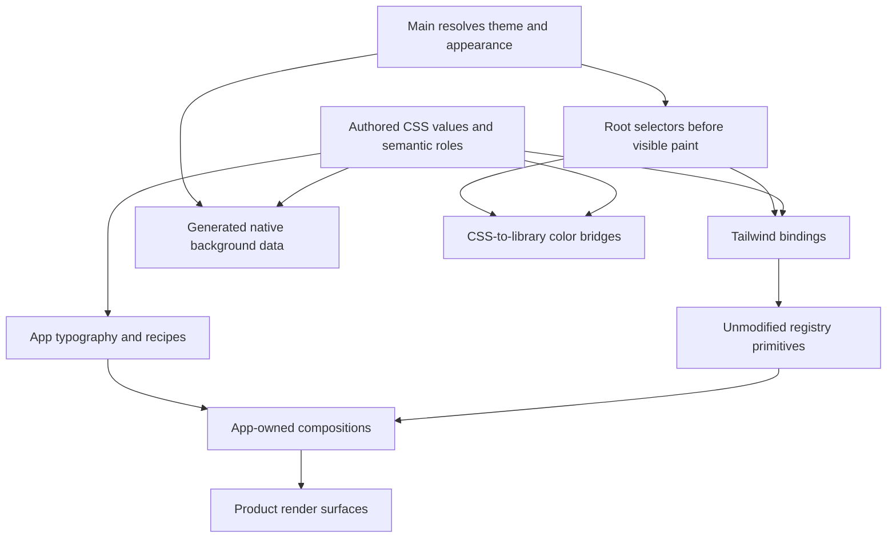

# Proposed desktop token and theme system

2026-10-01. Proposal based on [the source audit](2026-10-01-token-theme-audit.md), [styling usage](2026-10-01-styling-reuse-audit.md), and two independent studies: [token architecture](2026-10-01-token-architecture-practices.md) and [theme management](2026-10-01-theme-management-practices.md).

The user later clarified that the app is not live. [The clean-slate plan](2026-10-01-clean-slate-design-system-plan.md) is now the recommended implementation direction. It replaces the migration sequence and single-file source layout below. The shared semantic roles and ownership evidence remain relevant.

Keep CSS as the authored visual contract. Keep shadcn's existing semantic names where they already express the role. Give app typography, owner-specific geometry, reusable recipes, and runtime measurements explicit owners. Resolve theme identity and appearance once, then send the same result to every consumer.

This is a proposed migration, not an implemented system. The color examples demonstrate the contract and do not approve a new palette. The separately completed [shadcn adaptation and update workflow](2026-10-01-shadcn-adaptation-workflow.md) gives the detailed process for preserved defaults and opt-in app compositions.

## Decisions

| Decision | Recommendation | Reason |
| --- | --- | --- |
| Authored format | CSS first | Matches the existing renderer, Tailwind, and shadcn integration |
| Shared contract | One `tokens.css`, organized by responsibility | Preserves the repo's current contract and keeps discovery in one place |
| Default utility names | Preserve Tailwind and shadcn size meanings | Honors the user's requirement to keep original component styling |
| Product typography | Named app roles outside the default size namespace | Prevents implicit changes to registry components |
| Component geometry | Local variables beside the owner | Removes component names from the global semantic contract |
| Theme identity | Separate from `system | light | dark` | A theme can supply both appearances |
| Runtime authority | Main owns saved and resolved theme state | Aligns native windows, persistence, and the renderer |
| Native background | Generated from authored CSS | Eliminates the stale manually mirrored palette |
| Style reuse | Tokens for values, recipes for combinations, modules for behavior | Assigns changes to the smallest proven owner |
| Vendor adaptation | App-owned composition outside `components/ui` | Keeps the registry source boundary reviewable |
| JSON token generation | Deferred until a real consumer needs interchange | Avoids a second authoring contract without current benefit |

These are Argo-specific engineering choices. DTCG supports interchange and mature systems demonstrate token layers, but no cited standard requires this exact structure. [DTCG format](https://www.designtokens.org/TR/2025.10/format/), [Tailwind theme variables](https://tailwindcss.com/docs/theme), [shadcn theming](https://ui.shadcn.com/docs/theming).

Phase 1 must clarify the current documentation conflict. `docs/design-stack.md` says all design tokens live in the global file, while desktop rules permit named component-local tokens. The proposed rule is one global shared/theme contract, with owner-local geometry beside its owner. It requires an explicit documentation update.

## A contributor's choice

When adding a visual decision, use this order:

1. Choose an existing shared role when its meaning matches the use.
2. Choose an existing registry variant or app composition when its structure and behavior match.
3. Keep one owner's geometry and layout in that owner.
4. Promote a value or recipe when independent owners must change together.
5. Add a new shared role only when the current role vocabulary cannot express the intent.

An equal number is insufficient evidence for promotion. A shared alignment, interaction state, or text purpose is evidence. There is no target number of tokens and no rule that every CSS length needs a global token.

## Responsibilities



This shows ownership and consumption, not a requirement to create one module per box. Local layout stays with product owners.

### Authored values and semantic roles

Organize `tokens.css` in this order:

1. Stable app foundations: fonts, app typography roles, repeated geometry, and motion.
2. Public semantic color roles, including the shadcn compatibility contract.
3. Complete default Light and Dark value sets.
4. Explicit custom-theme overrides and their documented inheritance.
5. Tailwind bindings for public utility-facing roles.

Do not reset all of Tailwind with `--*: initial`. That removes utility families that registry components expect. A raw Tailwind swatch can be an implementation value of a named role. Product code must select the role rather than the swatch. Tailwind documents namespace resets and distinguishes ordinary variables from utility definitions. [Tailwind theme variables](https://tailwindcss.com/docs/theme).

Keep optional reference values only where they remove meaningful duplication or need independent adjustment. Do not add a palette alias for each literal. The authored role can contain its value directly.

### The shadcn compatibility contract

Retain the names that generated components consume:

| Family | Required names |
| --- | --- |
| Main surfaces | `background`, `foreground`, `card`, `card-foreground`, `popover`, `popover-foreground` |
| Actions and interaction | `primary`, `primary-foreground`, `secondary`, `secondary-foreground`, `accent`, `accent-foreground` |
| Quiet content | `muted`, `muted-foreground` |
| Boundaries and focus | `border`, `input`, `ring`, `destructive` |
| Sidebar | `sidebar`, its foreground, primary pair, accent pair, border, and ring |
| Charts | `chart-1` through `chart-5` for official default-theme compatibility and future chart support |
| Shape | `radius` and its registry scale bindings |

This table combines current component dependencies with the official default-theme contract. The installed UI has no chart component or chart-role reader. Retaining chart roles is an explicit compatibility policy, not a current component dependency. Future registry additions can depend on those roles. Compare actual dependencies with the selected registry on updates. [shadcn theming](https://ui.shadcn.com/docs/theming).

Do not replace these roles with a complete second vocabulary such as `argo-card`, `argo-primary`, and `argo-muted`. That adds two names for one decision and conflicts with ADR-0038's mapping policy.

Use `@theme inline` for utility bindings to runtime values:

```css
@theme inline {
  --color-background: var(--background);
  --color-foreground: var(--foreground);
  --color-primary: var(--primary);
  --color-primary-foreground: var(--primary-foreground);
}
```

The installed compiler confirms that `bg-primary` reads `var(--primary)`. A component does not need a new class string for each palette. This is the distinction between a semantic theme value and a utility that consumes it. [Compiler evidence](2026-10-01-token-inventory.json), [Tailwind theme variables](https://tailwindcss.com/docs/theme).

### Additional app color roles

Add only missing purposes. Current needs include status marks, status text, diff additions, syntax, ANSI output, and external label colors. They are different purposes even if some values match.

| Current use | Proposed policy |
| --- | --- |
| Running, idle, attention, error | Shared status roles named for meaning, with text and mark uses evaluated separately |
| Success | Keep distinct from running unless the product defines one meaning for both |
| Selected row and hovered menu item | Use `accent` where meaning matches; keep a selected role only if the states must diverge |
| Supporting text | Start with `muted-foreground`; retain another level only with a documented hierarchy and contrast use |
| Diff text | Keep a shared diff role when multiple code surfaces consume it |
| Syntax and ANSI | Keep explicit content palettes or bridges, with one authority for each |
| GitHub and Linear label colors | Treat the incoming color as data; derive readable presentation through one adapter |
| Lightbox scrim | A named scrim role can remain fixed black across appearances |
| Decorative or native identity colors | Keep local or remove when inactive; do not promote into a general theme vocabulary |

For each status color, list actual ground/text pairings. One green tested on the canvas does not prove it works as a small dot, text on a tinted badge, and a blended progress mark. WCAG contrast applies to the resulting colors and relevant adjacent surfaces. [W3C text contrast](https://www.w3.org/WAI/WCAG22/Understanding/contrast-minimum), [W3C non-text contrast](https://www.w3.org/WAI/WCAG22/Understanding/non-text-contrast).

Do not copy every historical PR or plan color into the new role list. The inventory finds no static production readers for those names. Remove them only after checking the documented vendor contract and any dynamic reader.

### App typography

Preserve default `text-xs`, `text-sm`, and `text-base` meanings. Stop using the global size namespace to make registry components look like app modules.

Keep the app's finite role vocabulary: title, heading, body, prose, control, supporting metadata, navigation, and code. `type-label` can remain an intentional alias for control if it expresses the same role. Resolve `type-caption` to an existing role before adding another rung.

Store composite metadata outside Tailwind's functional font-size namespace. An illustrative structure is:

```css
:root {
  --typography-body-size: 14px;
  --typography-body-line-height: 20px;
  --typography-body-weight: 400;
  --typography-body-tracking: normal;
}

@utility type-body {
  font-size: var(--typography-body-size);
  line-height: var(--typography-body-line-height);
  font-weight: var(--typography-body-weight);
  letter-spacing: var(--typography-body-tracking);
}
```

The app role is an explicit opt-in. The default Tailwind rung remains available. This avoids accidental utilities such as `text-body-weight` and avoids the current doubled selectors.

A complete role owns its default weight and tracking. Do not combine it with contradictory weight classes and depend on compiler order. For a heading, choose the heading role. For a repeated strong-body variant, define that variant in the relevant recipe. An exceptional device code can own a justified local letter-spacing treatment.

Review `cn` alongside these changes. Its custom font-size list currently includes metadata and omits newer role names. Register actual app utility groups only where class merging needs them. Test merging at the public composition interface instead of hand-copying all custom-property names.

The typography migration must prepare app compositions before removing the global remapping. Otherwise, direct registry callers can change size halfway through the migration. Also move global unlayered icon, input-ring, and control-weight overrides into explicitly scoped app styling. Restoring size names alone cannot preserve vendor rendering. The separate shadcn workflow addresses that order in detail.

### Spacing, dimensions, icons, shape, and motion

Keep shadcn's size variants and default numeric utility scale available. Numeric spacing is valid for local arrangement. A product recipe can use named app spacing when several owners need the same relationship.

Consolidate the two current spacing vocabularies by intent. Keep a small shared set for shell gutter, content inset, section separation, and repeated compact gaps. A Feed-only paragraph gap can be local. An alias that gives a component independent control can remain local rather than expanding the global vocabulary.

Keep shared cross-owner alignments such as chrome height global. Move one composer's menu width and one inspector's minimum width to their owners. A control's registry variant and a split panel's minimum width are different kinds of dimensions.

Keep pixel-valued dimensions at the existing `readCssSize` boundary until that boundary resolves units. Its `parseFloat` behavior cannot interpret `calc()` or convert `rem`. Changing token units and fixing the reader is one coordinated change.

For icons, retain independent roles only when their geometry must diverge. Remove the `meta`/`metadata` spelling duplication. Prefer the existing `Icon size` interface and registry size variants over caller-specific numeric overrides that correct one shared default.

Keep circular marks and pill shapes distinct from bordered surface corners. Radius equality does not prove a shared role. Motion roles express repeated interaction timing. Runtime exit duration and measured panel height remain explicit runtime inputs when they control behavior.

### Recipes and compositions

A recipe combines roles for a repeated visual pattern. It does not own unrelated state. Existing `panel-*` utilities, Feed card radius, and Session link styling are examples to refine.

Use an existing module when the repeated pattern also shares structure, behavior, or accessibility. The audit's first candidates are `ContractFailureAlert`, the copy control, Session inspector headers, and onboarding media/detail rows. Start in the existing owner. Promote to platform renderer only when cross-domain use proves compatible.

Product screens keep local layout utilities. Avoid a catch-all styled box or a polymorphic row with every interaction mode. The useful interface is one where callers can select a role or variant without reconstructing the complete class string.

## Theme management

### Theme identity and appearance

Use a validated state with separate fields:

```ts
type ThemeSelection = {
  themeId: string
  appearance: 'system' | 'light' | 'dark'
}

type ResolvedTheme = ThemeSelection & {
  dark: boolean
}
```

This is a conceptual shape. The implementation must derive types from boundary schemas and reject unknown identifiers. Built-in theme identifiers can use a closed schema. Imported themes, if approved later, need their own validation contract.

Main resolves System with `nativeTheme`. In the proposed system, it persists the preference and theme identifier, then sends one resolved state to each window. The renderer applies `data-theme`, `.dark`, and `color-scheme` to `<html>` together. Preserve existing unknown portable-document fields when saving. Current source lacks the getter/setter expected by the renderer, so implementation must first establish a validated initial-state transport, mutation operation, and subscription.

This keeps portals under the same root values. It also gives JS consumers a change key containing theme identity and appearance. Two dark themes must still produce a change event. [Electron nativeTheme](https://www.electronjs.org/docs/latest/api/native-theme), [React portals](https://react.dev/reference/react-dom/createPortal).

### A custom theme

A custom theme changes values, not component class strings. Use explicit root selectors and complete appearance resolution. These selector examples are illustrative:

```css
:root { /* Default light values. */ }
:root.dark { /* Default dark values. */ }
:root[data-theme="forest"] { /* Forest light overrides. */ }
:root[data-theme="forest"].dark { /* Forest dark overrides. */ }
```

Every selectable theme needs a validated resolved Light set and Dark set. A custom theme can explicitly inherit unchanged roles from the default. Its declaration must list that inheritance, and the validation must evaluate the final matrix rather than count source declarations.

Required checks cover all shadcn compatibility roles and the app roles that theme affects. Stable geometry can remain shared. System is not a third token set. High contrast, density, and independent syntax themes are separate product decisions, not implicit features to add now.

Adding a built-in theme then requires a bounded operation: add its values, register its identifier, supply generated native background data, and pass the theme matrix and render checks. Product component code does not change.

A user-imported theme editor is outside this request. Making future custom themes easy does not require arbitrary CSS injection or a new settings platform.

### First paint and native background

Author the opaque `--background` value once in CSS. Generate the native lookup at build time with a CSS parser. To keep that generator small, require this native-facing role to resolve to an explicit Electron-compatible color for each registered theme and appearance. Other roles can keep normal CSS expressions.

The generated lookup is a derived artifact, never a second hand-edited palette. Validate its equality with the browser's resolved background. Keep the generator's inputs and supported selector shape explicit. Do not attempt to reimplement the whole CSS cascade in main.

Resolve stored state before creating the window. Apply the renderer's initial state before showing it. Use the existing preload and window lifecycle to prove the ordering under the app's CSP. Do not assume changing an effect to `useLayoutEffect` proves first paint. [Electron BrowserWindow](https://www.electronjs.org/docs/latest/api/browser-window/), [Tailwind dark mode](https://tailwindcss.com/docs/dark-mode).

On OS updates or explicit changes, update the native ground and root state from the same resolved answer. Test multiple open windows if the app keeps appearance global.

### Library bridges

Keep CSS values live where the consumer supports `var()`. When a library needs a concrete color, resolve CSS at that boundary. Mermaid already converts CSS colors through a canvas, but returns `rgba(...)` while its official theming guide documents hex-only color inputs. Make the bridge output documented hex colors and define how alpha composites over the intended ground, or prove another supported format against the pinned package. Redraw after the new root state is applied. [Mermaid theming](https://mermaid.js.org/config/theming.html#color-and-color-calculation).

Define one syntax policy for Shiki and CodeMirror. If syntax follows the app theme, configure both from the same authored syntax roles. If syntax is independent, name and persist that independent selection. Do not leave the policy implicit in two different Xcode implementations.

Cache expensive library initialization by the resolved theme key where needed. A DOM mutation observer of only `.dark` is insufficient for custom theme identity. Do not add a separate theme store for each library.

## Decisions that need agreement before implementation

ADR-0038 remains the accepted surface and shadow policy. The current translucent composer, anchored shadow, and extra content ground conflict with it. The conservative migration follows the accepted policy. Retaining those features requires a scoped superseding ADR before implementation.

The user's vendor requirement also changes the current practice: app typography must no longer redefine the default size rungs. The detailed shadcn follow-up must settle pristine source, allowed theme values, adaptation boundaries, and update proof. That workflow does not require approval for this research.

The final palette and the names of any genuinely new text hierarchy levels remain design choices. The report specifies the system for those choices; it does not infer brand colors from a best-practice article.

## Migration phases

### Phase 0: Baseline and evidence

Completed by this research. Record the source revision, token inventory, compiler bindings, usage clusters, and decision conflicts. Preserve a reader map for every removal or rename.

Exit condition: every proposed cleanup points to an inventory entry or a concrete usage cluster. Dynamic and vendor-owned exceptions are named.

### Phase 1: Set the contract

Agree on shared roles, local geometry, app typography, vendor boundaries, and the ADR-0038 decision. Document the approved role matrix in the existing design contract. Keep the research proposal separate from that normative change.

Exit condition: a contributor can choose a value, role, recipe, or composition without inventing a new global family. Every changed policy names the old policy it replaces.

### Phase 2: Repair definite source defects

Remove the conflicting navigation declaration after confirming intent. Resolve the missing inspector inset and undefined caption role. Remove incorrect typography metadata from the size namespace through a coordinated migration. Correct the native/CSS background relationship and repair the missing appearance transport.

Exit condition: no same-block token collision, no unowned required variable, and no compiler-generated typography metadata size. These changes need focused contract tests. Render affected surfaces in Light and Dark.

### Phase 3: Implement the resolved theme state

Extend the validated appearance contract with theme identity. Implement one root application operation, the generated native background data, startup ordering, and full library invalidation. Retain existing System behavior.

Exit condition: Light, Dark, and System work at startup and while open. Use a complete second theme fixture in this phase to prove that switching within one appearance updates DOM, portals, diagrams, editor policy, and native ground. Phase 7 turns that proof into a reviewed selectable product theme.

### Phase 4: Consolidate semantic colors

Migrate ink/faint/icon/selection overlaps by meaning. Retain paired shadcn names. Name additional status and content roles only where actual consumers need them. Review and remove inactive plan, PR, traffic-light, and decorative names with documented reader evidence.

Exit condition: each public color has an owner, a meaning, a complete resolved theme set, and recorded foreground/ground uses. Contrast clears the actual interactive surfaces in both appearances.

### Phase 5: Restore default typography through explicit app composition

Prepare the app role utilities and compositions first. Migrate product callers, including the Empty example, to explicit app typography. Restore default Tailwind rungs after the callers have an explicit contract. Scope or remove global icon, focus-ring, and control-weight overrides. Compare registry components and adapted app components independently.

Exit condition: pristine registry components retain the expected default geometry and typography. Adapted Empty content and equivalent custom app content share the same app roles. Product CSS no longer changes registry sizes by namespace collision.

### Phase 6: Localize geometry and finish proven reuse

Move component dimensions to their owners. Consolidate metadata icon spelling and duplicate viewport constraints. Reuse existing failure alerts and copy-control variants. Finish the inspector and onboarding recipes without expanding them into generic layout modules.

Exit condition: global dimensions express proven shared decisions. Owner-local geometry is discoverable beside its owner. Callers no longer correct the same shared default repeatedly.

### Phase 7: Prove a second theme and protect the system

Add a small second theme to exercise the contract. It must change values through the declared mechanism without product component edits. Make Storybook and relevant screen review cover both appearances and the new theme. Wire the approved mechanical rules into the existing quality workflow.

Exit condition: theme additions require values and registration, not per-component fixes. The contract fails for missing roles, invalid aliases, collisions, undefined required variables, or stale native backgrounds.

## Verification during implementation

| Subject | Proof |
| --- | --- |
| Definitions | Parse CSS and reject duplicate names within one authored scope |
| Theme resolution | Validate aliases and the full required role matrix for every theme and appearance |
| References | Recognize utility namespaces, local values, runtime properties, and documented vendor variables |
| Class composition | Test intended role/variant behavior through the app-owned interface |
| Native equality | Compare generated native backgrounds with resolved CSS backgrounds |
| Startup | Observe selectors and native color before the first visible packaged frame |
| Theme change | Exercise System updates and two identities within the same appearance |
| Accessibility | Run Light and Dark axe coverage plus state-specific contrast review |
| Visual consistency | Review affected app compositions, original registry components, and shipped screens separately |
| Source policy | Report vendor drift and protect default utility namespaces |

Contract tests can inspect parser or compiler outputs. Story `play` functions keep asserting reader-visible behavior and accessibility under the repo's existing rule. Temporary captures are inspected and deleted.

Each implementation phase needs its own reviewed diff and required gates. Do not rewrite every token and component in one change. For removals or reversions, use the landing trailers. A new theme that only passes on the canvas is incomplete when selected rows, dialogs, or code blocks fail.

## What this research delivers

The source evidence and two primary-source studies support a concrete architecture and staged migration. Production CSS, components, appearance state, and runtime behavior remain unchanged. The implementation needs product decisions about the conflicting surface policy and final palettes, plus the verification described above.
